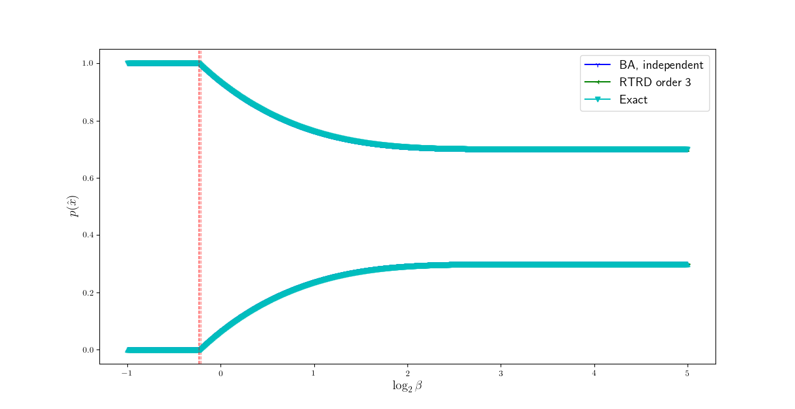

# Root Tracking for Rate-Distortion

This is the source code accompanying the paper [1]: _Root Tracking for Rate-Distortion: Approximating a Solution Curve with Higher Implicit Multivariate Derivatives_, by S. Agmon. [arXiv preprint here](https://arxiv.org/abs/2206.11369).


## Table of Contents

* [Purpose](#purpose)
* [Logical components](#logical-components)
* [Language and dependencies](#language-and-dependencies)
* [Structure of source code](#structure-of-source-code)
* [Usage](#usage)
* [Contact and support](#contact-and-support)
* [References](#references)
* [License](#license)


## Purpose

[Rate-Distortion (RD) Theory is the theoretical foundation of lossy data compression.](https://en.wikipedia.org/wiki/Rate%E2%80%93distortion_theory) 
The _rate-distortion curve_ captures the fundamental tradeoff between input compression and resolution. 
This work provides a new family of numerical algorithms for tracing the path of optimal source encodings along the rate-distortion curve as input information is compressed, under mild assumptions, yielding a piecewise polynomial approximation of its path. See [1] for details. 


## Logical components

Mathematically, an optimal input encoding is also a root of the _RD operator_, [1, Equation (1.2)]. 
To follow its path along the rate-distortion curve, we provide three main components:

1. A formula for multivariate implicit derivatives of arbitrary order at an operator's root in terms of the operator's derivative tensors.
2. Closed-form formulas for RD's higher derivative tensors. 
3. An understanding of RD bifurcations. 

The formulas of (2) allow to specialize (1) to RD, thereby allowing to compute implicit derivatives at an RD root, to arbitrary order.
Using these, one can approximate RD roots in the vicinity of a given one (see Eq. (1.5)). 
Next, an understanding of the solution structure is necessary to follow the path where the approximation is not valid anymore. Namely, at RD bifurcations (3). 

These components are implemented by the software provided here, with references to the paper to assist the reader.
The [code structure section](#structure-of-source-code) below elaborates what is implemented where. 


## Language and dependencies

This project was written and tested in Python 3.7.3, using numpy and sympy. [See here for package listing and version numbers.](package_list.txt) 


## Structure of source code

The source generally follows the [logical structure](#logical-components) of this work. Its main files are:

- Common definitions for working with RD problems are in [RD_defs.py](RD_defs.py). e.g., define an RD problem, its computation parameters, how to represent an RD root, and various debug and configuration parameters used throughout.
- The mathematical machinery for computing implicit multivariate derivatives at a root of an (arbitrary) operator in terms of its derivative tensors (component #1), [1, Algorithm 1], is implemented in [root_tracking.py](root_tracking.py). 
- [RD_root_tracking.py](RD_root_tracking.py) implements the formulas of [1, Theorem 4] for the higher derivative tensors of RD (component #2), which allows the specialization of [1, Algorithm 1] to RD.  
- [RD_solver.py](RD_solver.py) provides our implementation of several algorithms for solving RD problems: 
  - Root-Tracking for RD [1, Algorithm 3];
  - Blahut-Arimoto's algorithm [2];
  - and the exact solution of a Binary Source with a Hamming distortion measure.
- [RD_plotting_tools.py](RD_plotting_tools.py) provides convenience functions for visualizing the solutions.


Additional files:

- The toy problems used at [1] are encoded in [toy_RD_problems.py](toy_RD_problems.py).
- Computing the higher derivative tensors of RD requires the polynomials $`P_k(x_0, ..., x_k)`$, defined at [1, Eqs. (2.23)-(2.24)]. Their algebraic form is cached in [.P_k_cache.pkl.lzma](.P_k_cache.pkl.lzma), precomputed for orders $`k=0,...,25`$. 
- [package_list.txt](package_list.txt) lists the packages used during development.
- [README.md](README.md) is this file.


## Usage

Start with the definitions file,

```python
>>> import RD_defs
```
It contains definitions for working with RD problems and various configurations used across this software. 

Suppose we want to define an RD problem by a binary source with a Hamming distortion measure and compute its solutions. 

```python
>>> import toy_RD_problems
>>> prob, params = toy_RD_problems.binary_source_with_Hamming_distortion(p=0.3)
```

This gives an RD problem definition `prob` represented by an `RD_problem` instance, and some default computation parameters in an `RD_compute_params` instance. 

```python
>>> prob
0: RD_problem(problem_name='Binary source~Bernoulli(0.3) with a Hamming distortion', p_x=array([[0.7],
       [0.3]]), D=array([[0, 1],
       [1, 0]]))
>>> params
1: RD_compute_params(computation_method='independent', BA_stopping_condition=1e-09, uniform_initial_conditions=True, log2_beta_range=[-1, 5], sample_num=3000, max_BA_iters_allowed=1000000)
```

The toy problems used in [1] (and more) are pre-defined in `toy_RD_problems`. 
In this case, computing along a grid with Blahut's algorithm [2] initialized independently at the uniform distribution, using the following stopping condition.

```python
>>> params.computation_method, params.BA_stopping_condition
2: ('independent', 1e-09)
```

To solve an RD problem numerically, load the solver module

```python
>>> import RD_solver
```

While it provides separate methods per algorithm (and more), it also has a convenience dispatcher, which invokes the algorithm defined by `computation_method`,

```python
>>> sols_BA = RD_solver.solve_RD_probs(prob, params)
Starting BA computation. RD problem: RD_problem(problem_name='Binary source~Bernoulli(0.3) with a Hamming distortion', p_x=array([[0.7],
       [0.3]]), D=array([[0, 1],
       [1, 0]]))
Computation parameters: RD_compute_params(computation_method='independent', BA_stopping_condition=1e-09, uniform_initial_conditions=True, log2_beta_range=[-1, 5], sample_num=3000, max_BA_iters_allowed=1000000)
Done computing.
Computation's duration: 0:00:10.146738
```

This returns a list of approximate RD roots (solutions), each represented by an `RD_sol_point` instance,

```python
>>> len(sols_BA)
3: 3000
>>> sols_BA[0]
4: RD_sol_point(p_t=[[9.99999989e-01]
 [1.12346114e-08]], beta=0.5, iter_count=203)
```

Now solving with root-tracking for RD, [1],  
```python
>>> _, params_for_RTRD = toy_RD_problems.binary_source_with_Hamming_distortion_for_RTRD(p=0.3)
>>> sols_RTRD = RD_solver.solve_RD_probs(prob, params_for_RTRD)
Starting RTRD computation, using *fixed* order and step-size. Problem: RD_problem(problem_name='Binary source~Bernoulli(0.3) with a Hamming distortion', p_x=array([[0.7],
       [0.3]]), D=array([[0, 1],
       [1, 0]]))
Computation parameters: RD_compute_params(computation_method='diff-eq fixed order and step size', BA_stopping_condition=1e-09, uniform_initial_conditions=True, log2_beta_range=[-1, 5], max_BA_iters_allowed=1000000, order=3, step_size=0.01, cluster_mass_threshold=0.01)
Done 2 BA iterations to obtain an initial solution at beta=32.
Tracking till bifurcation: starting at beta=32 on the problem reduced to 2 clusters.
Reached bifurcation, 3115 solutions generated. Last solution before bifurcation: RD_sol_point(p_t=[[0.99343155]
 [0.00656845]], beta=0.8599999999977979)
Estimated marginal at bifurcation is [1. 0.]; will use BA at beta=0.86
Reduced solution computed with 1 BA iterations:
RD_sol_point(p_t=[[1.]
 [0.]], beta=0.8599999999977979, iter_count=1)

Done computing at beta=0.86; support size=1
Computation's duration: 0:00:34.586613
```

This particular problem also has an analytical solution. For comparison, we request the exact solution to be computed on the same grid-points as with BA,
```python
>>> sols_exact = RD_solver.exact_solutions_for_binary_source_with_Hamming_distortion(p=0.3, requested_betas=[s.beta for s in sols_BA])
```

`RD_plotting_tools` allows easy plotting of RD problems. To compare the solutions,
```python
>>> import RD_plotting_tools
>>> sols_list, labels = [sols_BA, sols_RTRD, sols_exact], ['BA, independent', 'RTRD order 3', 'Exact']
>>> RD_plotting_tools.plot_cluster_marginals(prob, params, sols_list, labels=labels)
```

<center></center>

And the resulting RD curves,
```python
>>> RD_plotting_tools.plot_rate_distortion_curve(prob, params, sols_list, labels=labels)
```
<center></center>

Since these curves are visually indistinguishable, we would like to compare the errors of BA and RTRD from the exact solutions. 
Unlike BA, which approximates RD roots only at pre-specified grid-points, RTRD yields a piecewise polynomial approximation. 
This allows a cheap approximation of off-grid solutions. 
To demonstrate this, we compare the error of both algorithms on the grid-points used by BA, 

```python
>>> sols_extrapolated_from_RTRD = RD_solver.extrapolate_intermediate_RTRD_solutions(sols_RTRD, requested_betas=[s.beta for s in sols_BA])
```

Now, setting the analytical solutions with the `reference_sols` parameter, we compare the errors

```python
>>> RD_plotting_tools.plot_error_from_reference_by_beta(prob, params, reference_sols=sols_exact, compared_sols=[sols_BA, sols_extrapolated_from_RTRD], labels=['BA error', 'RTRD error'])
```

<center></center>

Despite the deliberate concessions in RTRD's design, BA and RTRD have similar error and roughly comparable computation times in this example. See [1, Figure 1.2] and Section I.3.3 therein for a comparison between these algorithms.


## Contact and support

Feedback is welcomed, to shlomi.agmon [at the domain] mail.huji.ac.il.

This project is provided AS-IS, with no support guarantees.


## References

The following reference numbers are used throughout the project files.

[1] S. Agmon. _Root Tracking for Rate-Distortion: Approximating a Solution Curve with Higher Implicit Multivariate Derivatives_. [arXiv preprint arXiv:2206.11369](https://arxiv.org/abs/2206.11369), 2022.

[2] R. Blahut. _Computation of channel capacity and rate-distortion functions_. IEEE Transactions on Information Theory, 18(4):460–473, 1972.

[3] T. Berger. _Rate Distortion Theory: A Mathematical Basis for Data Compression_. Prentice-Hall, 1971.

[4] S. Agmon, E. Benger, O. Ordentlich, and N. Tishby. _Critical slowing down near topological transitions in rate-distortion problems_. In 2021 IEEE International Symposium on Information Theory (ISIT), pages 2625–2630. IEEE, 2021.


## License 
This project is open source and available under the [BSD 3-Clause "New" or "Revised" License](LICENSE.txt).
